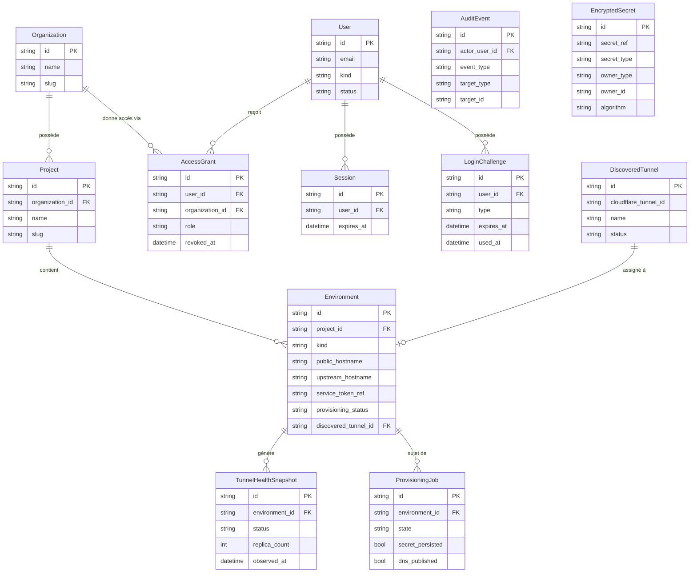

# Modèle de données — DevGate

Source de vérité : `apps/api/app/shared/models.py`

Le schéma suit le domaine métier, pas les écrans. Les colonnes de transport Cloudflare sont regroupées sur `Environment` et ne remontent jamais vers le frontend.

---

## Modèles

### User

Représente un utilisateur du système, qu'il soit membre d'agence ou client final.

| Champ | Type | Description |
|-------|------|-------------|
| `id` | string (UUID) | Clé primaire générée |
| `email` | string | Adresse email — unique, indexée |
| `display_name` | string \| null | Nom affiché dans l'interface |
| `kind` | string | `client` ou `agency` |
| `status` | string | `active` (défaut) |
| `last_login_at` | datetime \| null | Horodatage de la dernière connexion |
| `created_at` | datetime | Horodatage de création (auto) |

**Relations** : possède plusieurs `Session`, `LoginChallenge`, `AccessGrant`

---

### Organization

Représente un client de l'agence. Chaque organisation porte son propre branding.

| Champ | Type | Description |
|-------|------|-------------|
| `id` | string (UUID) | Clé primaire générée |
| `name` | string | Nom commercial |
| `slug` | string | Identifiant URL — unique, indexé |
| `branding_name` | string \| null | Nom affiché dans l'interface portail |
| `logo_url` | string \| null | URL du logo |
| `primary_color` | string \| null | Couleur principale (hex) |
| `support_email` | string \| null | Email de support affiché au client |

**Relations** : possède plusieurs `Project`, `AccessGrant`

---

### Project

Regroupe les environnements d'un même projet client.

| Champ | Type | Description |
|-------|------|-------------|
| `id` | string (UUID) | Clé primaire générée |
| `organization_id` | FK → Organization | Organisation parente |
| `name` | string | Nom du projet |
| `slug` | string | Identifiant court |
| `status` | string | `active` (défaut) |
| `description` | text \| null | Description libre |

**Relations** : appartient à `Organization`, possède plusieurs `Environment`

---

### Environment

Représente un environnement déployé (staging, dev, preview…). C'est l'unité de ressource dans DevGate.

| Champ | Type | Description |
|-------|------|-------------|
| `id` | string (UUID) | Clé primaire générée |
| `project_id` | FK → Project | Projet parent |
| `name` | string | Nom affiché |
| `slug` | string | Identifiant court |
| `kind` | string | `dev`, `staging`, `preview`, `internal` |
| `public_hostname` | string | Hostname public visible dans le portail |
| `upstream_hostname` | string \| null | Hostname upstream réel (jamais exposé au frontend) |
| `cloudflare_tunnel_id` | string \| null | ID du tunnel CF associé |
| `cloudflare_access_app_id` | string \| null | ID de l'application CF Access |
| `service_token_ref` | string \| null | Référence opaque vers le `EncryptedSecret` |
| `requires_app_auth` | boolean | L'application aval requiert une authentification propre |
| `status` | string | `active` (défaut) |
| `created_at` | datetime | Horodatage de création (auto) |
| `discovered_tunnel_id` | FK → DiscoveredTunnel \| null | Tunnel découvert assigné |
| `provisioning_status` | string | `pending`, `provisioning`, `active`, `failed` |

**Relations** : appartient à `Project`, possède plusieurs `TunnelHealthSnapshot`, `ProvisioningJob`

---

### AccessGrant

Lie un utilisateur à une organisation avec un rôle donné. Contrainte d'unicité sur `(user_id, organization_id)`.

| Champ | Type | Description |
|-------|------|-------------|
| `id` | string (UUID) | Clé primaire générée |
| `user_id` | FK → User | Utilisateur concerné (indexé) |
| `organization_id` | FK → Organization | Organisation concernée (indexée) |
| `role` | string | `client_member`, `reviewer`, `agency_admin` |
| `created_at` | datetime | Horodatage de création (auto) |
| `revoked_at` | datetime \| null | Horodatage de révocation (null = actif) |

**Relations** : appartient à `User` et `Organization`

---

### Session

Session serveur créée lors d'un login réussi. Transportée par cookie `devgate_session`.

| Champ | Type | Description |
|-------|------|-------------|
| `id` | string (UUID) | Clé primaire — valeur du cookie |
| `user_id` | FK → User | Utilisateur propriétaire (indexé) |
| `expires_at` | datetime | Date d'expiration (TTL configurable) |
| `created_at` | datetime | Horodatage de création (auto) |
| `last_seen_at` | datetime | Mis à jour à chaque requête authentifiée |
| `ip` | string \| null | Adresse IP lors de la création |
| `user_agent` | string \| null | User-Agent lors de la création |

**Relations** : appartient à `User`

---

### LoginChallenge

Challenge à usage unique créé lors d'une demande de connexion (magic link ou OTP).

| Champ | Type | Description |
|-------|------|-------------|
| `id` | string (UUID) | Clé primaire générée |
| `user_id` | FK → User | Utilisateur concerné (indexé) |
| `type` | string | `magic_link` ou `otp` |
| `hashed_token` | string | Hash du token envoyé par email |
| `expires_at` | datetime | Date d'expiration du challenge |
| `used_at` | datetime \| null | Horodatage de consommation (null = non consommé) |
| `attempt_count` | integer | Compteur de tentatives échouées |
| `created_at` | datetime | Horodatage de création (auto) |

**Relations** : appartient à `User`

---

### AuditEvent

Journal d'audit append-only. Enregistre tous les événements métier significatifs.

| Champ | Type | Description |
|-------|------|-------------|
| `id` | string (UUID) | Clé primaire générée |
| `actor_user_id` | FK → User \| null | Utilisateur auteur de l'action (null = système) |
| `event_type` | string | Type d'événement structuré (indexé) |
| `target_type` | string \| null | Type de la cible (`organization`, `environment`…) |
| `target_id` | string \| null | UUID de la cible |
| `metadata_json` | JSON \| null | Données contextuelles libres |
| `created_at` | datetime | Horodatage de l'événement (indexé, auto) |

Pas de relations ORM (append-only, pas de FK contraignante sur `actor_user_id`).

---

### TunnelHealthSnapshot

Instantané de santé d'un environnement, écrit par le health check service.

| Champ | Type | Description |
|-------|------|-------------|
| `id` | string (UUID) | Clé primaire générée |
| `environment_id` | FK → Environment | Environnement sondé (indexé) |
| `status` | string | `online`, `offline`, `unknown` |
| `replica_count` | integer | Nombre de réplicas actifs (0 en v1) |
| `observed_at` | datetime | Horodatage de la mesure (auto) |
| `metadata_json` | JSON \| null | `status_code`, `latency_ms`, ou détail d'erreur |

**Relations** : appartient à `Environment`

---

### EncryptedSecret

Stocke les secrets chiffrés en base (AES-256-GCM). Les objets métier ne stockent que la référence opaque `service_token_ref`.

| Champ | Type | Description |
|-------|------|-------------|
| `id` | string (UUID) | Clé primaire générée |
| `secret_ref` | string | Référence opaque unique (`sec_<uuid>`) — indexée |
| `secret_type` | string | Type métier (`cloudflare_service_token`…) |
| `owner_type` | string \| null | Type du propriétaire (`environment`…) |
| `owner_id` | string \| null | UUID du propriétaire |
| `key_id` | string | Version de clé (`v1`) |
| `ciphertext` | text | Ciphertext AES-GCM en base64 (tag GCM inclus) |
| `nonce` | string | Nonce 96 bits en base64 (unique par chiffrement) |
| `algorithm` | string | `AES-256-GCM` |
| `metadata_json` | JSON \| null | Métadonnées libres |
| `created_at` | datetime | Horodatage de création (auto) |
| `rotated_at` | datetime \| null | Horodatage de rotation |
| `revoked_at` | datetime \| null | Horodatage de révocation |

Pas de relation ORM directe — accès uniquement via `SecretStore`.

---

### DiscoveredTunnel

Tunnel Cloudflare découvert lors d'une synchronisation de l'API CF. Source de vérité pour le provisioning semi-automatique (ADR-001).

| Champ | Type | Description |
|-------|------|-------------|
| `id` | string (UUID) | Clé primaire générée |
| `cloudflare_tunnel_id` | string | ID du tunnel dans l'API Cloudflare — unique, indexé |
| `name` | string | Nom du tunnel tel que renseigné dans CF |
| `status` | string | `discovered`, `assigned`, `orphaned` |
| `last_seen_at` | datetime \| null | Dernière synchronisation |
| `metadata_json` | JSON \| null | Données brutes retournées par CF |
| `created_at` | datetime | Horodatage de création (auto) |

---

### ProvisioningJob

Enregistre le déroulement de la saga de provisioning Cloudflare pour un environnement.

| Champ | Type | Description |
|-------|------|-------------|
| `id` | string (UUID) | Clé primaire générée |
| `environment_id` | FK → Environment | Environnement provisionné (indexé) |
| `provider` | string | `cloudflare` (défaut) |
| `state` | string | État courant de la saga (voir valeurs ci-dessous) |
| `attempt_count` | integer | Nombre de tentatives |
| `last_error` | text \| null | Dernier message d'erreur |
| `cloudflare_access_app_id` | string \| null | App CF Access créée |
| `cloudflare_policy_id` | string \| null | Politique CF Access créée |
| `cloudflare_service_token_id` | string \| null | Service token CF créé |
| `dns_record_id` | string \| null | Enregistrement DNS créé |
| `secret_persisted` | boolean | Secret stocké dans le `SecretStore` |
| `dns_published` | boolean | DNS publié |
| `created_at` | datetime | Horodatage de création (auto) |
| `updated_at` | datetime \| null | Mis à jour à chaque transition d'état |

**États possibles pour `state`**

```
pending → creating_access_app → access_app_created
        → creating_policy → policy_created
        → creating_service_token → service_token_created_unsealed
        → secret_persisted → creating_dns → active
        
En cas d'erreur : failed_recoverable | failed_terminal
Compensation   : compensating → rolled_back
```

**Relations** : appartient à `Environment`

---

## Diagramme ER


