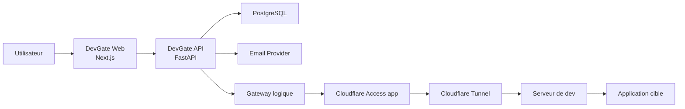
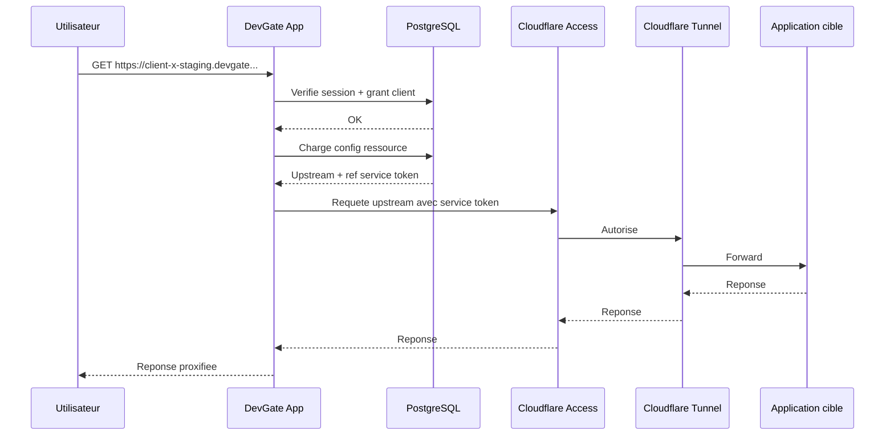
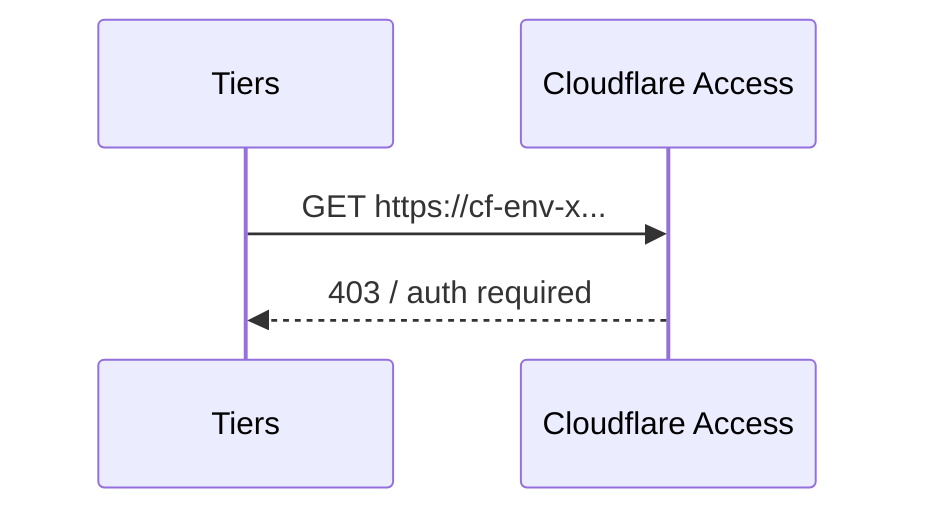
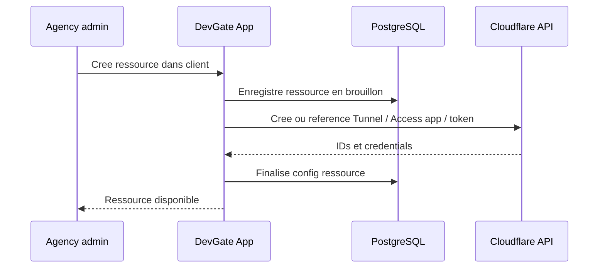

# System Design - DevGate - Lots 3 et 4

## Statut

Draft v1

## Perimetre

Ce document couvre explicitement :

- **Lot 3 - Gateway, transport et protection**
- **Lot 4 - Back-office, audit et exploitation**

Il suppose que les lots 1 et 2 sont deja cadres :

- acces v1 **par client** ;
- portail **brande agence uniquement** ;
- page client affichant directement les ressources ;
- login simple via magic link et/ou OTP email ;
- coexistence possible avec une auth applicative propre a la ressource.

Ce document reste volontairement concentre sur la cible v1 et v1.5 proche.  
Il ne cherche pas a definir une plateforme multi-tenant complexe ni une architecture HA lourde.

---

# system_design

## 1. Objectif

Definir une architecture technique exploitable pour :

- acheminer les utilisateurs authentifies depuis DevGate vers les bonnes ressources ;
- proteger les environnements meme si un hostname tunnel fuit ;
- administrer clients, utilisateurs et ressources ;
- journaliser les evenements importants et les connexions effectives ;
- superviser l'etat minimal du systeme.

## 2. Contraintes confirmees

### Produit

- l'utilisateur final ne doit pas voir ni utiliser directement les hostnames Cloudflare Tunnel ;
- les serveurs de dev ne doivent pas etre exposes directement sur Internet ;
- le modele d'acces v1 est **par client** ;
- certaines ressources peuvent exiger une auth applicative apres l'entree DevGate ;
- l'agence veut une experience login et portail maitrisee, pas delegatee a Cloudflare ;
- le cout externe doit rester maitrise pour une cible d'environ :
  - `50 a 75` utilisateurs,
  - `20 a 25` ressources / environnements.

### Techniques

- trafic surtout HTTP/HTTPS ;
- websockets probables sur certaines ressources ;
- besoin de cookies et redirects compatibles apps web classiques ;
- risque principal : fuite de hostname tunnel, mauvaise configuration d'un environnement, ou perte de visibilite sur les acces.

## 3. Hypothese d'architecture retenue

### Cible v1

Architecture produit raisonnable :

- `DevGate Web`
  - `Next.js`
  - portail utilisateur
  - back-office web
- `DevGate API`
  - `FastAPI`
  - API admin
  - auth utilisateur
  - session
  - audit
  - gateway reverse proxy
- `PostgreSQL`
- `Email provider`
- `Cloudflare Tunnel`
- `Cloudflare Access` en **service auth** pour les upstreams

### Principe cle

Le navigateur parle uniquement a des URLs publiques `devgate`.

Le frontend `Next.js` parle au backend `FastAPI`.

Le gateway DevGate dans `FastAPI` :

- verifie la session utilisateur ;
- determine la ressource cible ;
- recupere les credentials de service vers la ressource ;
- appelle le hostname Cloudflare protege ;
- reverse-proxy la reponse vers l'utilisateur.

Donc :

- l'auth user reste chez DevGate ;
- l'autorisation edge vers la ressource reste chez Cloudflare Access ;
- le tunnel reste une brique de transport et de masquage d'origine.

## 4. Vue d'ensemble



### Lecture

- `Next.js` et `FastAPI` restent une seule architecture produit, pas des microservices.
- `Cloudflare Access` ne sert pas de login utilisateur principal.
- `Cloudflare Access` sert de **barriere edge** exigeant un credential de service sur chaque upstream.

## 5. Composants

## 5.1 DevGate API

Responsabilites :

- login
- sessions
- back-office agence
- grants d'acces par client
- configuration des ressources
- audit
- orchestration minimale avec Cloudflare si necessaire

### Recommendation v1

Un backend `FastAPI` unique.

Pourquoi :

- plus simple a debugger ;
- moins de friction pour les lots 3 et 4 ;
- largement suffisant pour la cible de charge.

## 5.1 bis DevGate Web

Responsabilites :

- login page
- portail utilisateur
- page client
- detail ressource
- interstitiel double auth
- profil
- back-office web

### Recommendation v1

Une web app `Next.js`.

## 5.2 Gateway logique

Le gateway est une responsabilite technique, pas necessairement un service separe en v1.

Responsabilites :

- resoudre la ressource a partir du hostname public demande ;
- verifier la session et les grants ;
- charger la configuration upstream ;
- ajouter le ou les headers de `service token` ;
- proxifier la requete ;
- gerer redirects, cookies, timeouts, websockets, erreurs upstream.

### Recommendation v1

Le gateway est implemente dans le backend `FastAPI`.

### A revisiter plus tard

Si le trafic HTTP augmente ou si les comportements proxy deviennent trop complexes, extraction possible vers :

- un service dedie ;
- ou un proxy specialise pilote par DevGate.

## 5.3 Cloudflare Tunnel

Responsabilites :

- fournir un point d'entree edge sans exposer les ports entrants des serveurs de dev ;
- relier chaque ressource ou groupe de ressources a Cloudflare.

### Modeles possibles

- un tunnel par serveur ;
- un tunnel par groupe d'environnements ;
- un tunnel par environnement.

### Recommendation v1

Preferer :

- **un tunnel par serveur de dev** quand plusieurs apps proches cohabitent ;
- ou **un tunnel par environnement sensible** si l'isolation fonctionnelle est importante.

Eviter un tunnel par utilisateur ou un mapping trop fin des le debut.

## 5.4 Cloudflare Access

Responsabilites :

- exiger un credential de service pour joindre l'upstream protege ;
- bloquer les requetes directes non autorisees, meme si le hostname fuit.

### Recommendation v1

Une `Access app` par ressource exposee publiquement via DevGate.

Pourquoi :

- isole les credentials ;
- simplifie la rotation ;
- simplifie l'audit et le debugging ;
- evite des policies trop partagees.

### Trade-off

- plus de configuration a maintenir si le nombre de ressources augmente ;
- mais nettement plus lisible a ce stade.

## 5.5 PostgreSQL

Raison de choix :

- meilleur socle que SQLite pour :
  - connexions admin concurrentes,
  - audit,
  - sessions,
  - reporting futur,
  - migration vers une prod serieuse.

### Recommendation v1

- PostgreSQL des le depart

### Ce qui peut rester simple

- pas de replica
- pas de partitionnement
- pas de cache distribue

## 5.6 Secret store

Secrets a gerer :

- credentials email provider ;
- Cloudflare API token ;
- service tokens Cloudflare Access ;
- eventuels secrets internes.

### Recommendation v1

- environnement + gestion securisee de deploiement pour POC / MVP controle ;
- ou secret manager simple si disponible des maintenant.

Ne pas stocker les secrets complets en clair en base comme source de verite primaire.

---

## 6. Flux techniques

## 6.1 Acces a une ressource



## 6.2 Tentative directe sur hostname tunnel fuite



## 6.3 Creation d'une ressource cote agence



### Remarque

Cette automation complete peut etre :

- partielle en v1 ;
- ou assistee par l'admin si l'API / le cout / le temps d'implementation ne justifient pas l'automatisation totale.

## 6.4 Connexion effective a auditer

Un evenement de connexion effective doit etre emis quand :

- la session utilisateur est valide ;
- la ressource cible est resolue ;
- le proxy vers l'upstream est effectivement engage.

Le simple affichage de la page client n'est pas une connexion a une ressource.

---

## 7. Decisions de design pour le lot 3

## 7.1 Resolution de la ressource

La ressource est resolue a partir du hostname public DevGate.

Exemple :

- `client-x-staging.devgate.agence.com`
- `preview-espace-membre.devgate.agence.com`

### Pourquoi

- compatible avec la spec lots 1 et 2 ;
- bon comportement pour cookies et URLs relatives ;
- plus propre qu'un routage purement en path.

## 7.2 Stockage de configuration upstream

Chaque ressource doit posseder au minimum :

- hostname public DevGate ;
- hostname upstream Cloudflare ;
- reference de l'Access app ;
- reference du service token ;
- flags techniques utiles :
  - websocket
  - auth app requise
  - timeout particulier
  - visible ou non dans le portail

## 7.3 Gestion des headers et cookies

Le gateway doit :

- preserver les headers applicatifs utiles ;
- injecter les headers d'auth service-to-service vers Cloudflare ;
- eviter de renvoyer au navigateur les credentials Cloudflare ;
- gerer correctement les cookies applicatifs issus des ressources.

### Watch points

- domaines de cookies ;
- redirects absolus ;
- CSP ;
- websockets ;
- grosses reponses ou uploads si cas particulier.

## 7.4 Gestion des erreurs

### Cas a distinguer

- session utilisateur invalide ;
- grant client absent ;
- ressource inconnue ;
- upstream indisponible ;
- Access service token invalide ;
- tunnel indisponible ;
- app cible en erreur.

### Recommendation UX/technique

- erreurs metier comprehensibles cote utilisateur ;
- erreurs techniques detaillees cote logs seulement ;
- pages ou messages de fallback coherents.

---

## 8. Decisions de design pour le lot 4

## 8.1 Perimetre du back-office v1

Le back-office v1 doit couvrir :

- creation client ;
- creation utilisateur dans client ;
- creation ressource dans client ;
- visualisation des ressources ;
- visualisation des acces ;
- visualisation d'un audit minimal ;
- visualisation d'un statut global minimal des ressources.

### Ce qu'on ne force pas en v1

- gestion de groupes ;
- policies IAM fines ;
- bulk actions sophistiquees ;
- workflows d'approbation ;
- reporting long terme avance.

## 8.2 Audit v1

Evenements minimum :

- login demande ;
- login consomme ;
- creation client ;
- creation utilisateur dans client ;
- creation ressource dans client ;
- connexion effective a une ressource.

### Recommendation

Stocker les evenements dans une table d'audit generique, avec :

- type d'evenement ;
- acteur ;
- cible ;
- timestamp ;
- metadata JSON restreinte.

## 8.3 Connexions effectives

Une connexion effective doit pouvoir etre rattachee a :

- utilisateur ;
- client ;
- ressource ;
- timestamp ;
- resultat (`success`, `denied`, `upstream_error`) ;
- contexte minimal (`ip`, `user_agent`, `request_id` si disponible).

## 8.4 Statut des ressources

Le statut minimal agence doit couvrir :

- visible / non visible dans DevGate ;
- configuration complete / incomplete ;
- upstream joignable ou non ;
- dernier check connu.

### Point encore ouvert

Afficher ou non une partie de ce statut cote client reste une decision produit ulterieure.

## 8.5 Niveau d'automatisation v1

### Option sobre recommandee

Automatisation **partielle** :

- creation de l'objet client / user / ressource dans DevGate automatisee ;
- rattachement a une config Cloudflare assiste ou semi-automatise ;
- health checks et audit automatises ;
- pas d'usine a provisioning complet des la v1.

### Pourquoi

- plus rapide a livrer ;
- moins de dette sur les integrations externes ;
- moins de risque de sur-concevoir avant usage reel.

---

## 9. Donnees et stockage

# data_model

## 9.1 Tables coeur

### `clients`

- `id`
- `name`
- `slug`
- `status`
- `created_at`
- `updated_at`

### `users`

- `id`
- `email`
- `display_name`
- `kind` (`client`, `agency`)
- `status`
- `last_login_at`
- `created_at`
- `updated_at`

### `client_user_memberships`

- `id`
- `client_id`
- `user_id`
- `role` (`client_member`, `client_admin`, `agency_admin`)
- `created_at`
- `revoked_at`

### `resources`

- `id`
- `client_id`
- `project_name` nullable
- `name`
- `slug`
- `kind`
- `status`
- `public_hostname`
- `upstream_hostname`
- `requires_app_auth`
- `is_visible_in_portal`
- `supports_websocket`
- `timeout_ms` nullable
- `created_at`
- `updated_at`

### `resource_transport_configs`

- `id`
- `resource_id`
- `cloudflare_tunnel_id`
- `cloudflare_access_app_id`
- `service_token_ref`
- `config_status`
- `last_synced_at`

### `sessions`

- `id`
- `user_id`
- `created_at`
- `expires_at`
- `last_seen_at`
- `ip`
- `user_agent`

### `login_challenges`

- `id`
- `user_id`
- `type` (`magic_link`, `otp`)
- `hashed_token`
- `requested_at`
- `expires_at`
- `consumed_at`
- `attempt_count`
- `status`

### `audit_events`

- `id`
- `actor_user_id` nullable
- `client_id` nullable
- `resource_id` nullable
- `event_type`
- `event_result`
- `request_id` nullable
- `ip` nullable
- `user_agent` nullable
- `metadata_json`
- `created_at`

### `resource_health_checks`

- `id`
- `resource_id`
- `check_type`
- `status`
- `latency_ms` nullable
- `details_json`
- `observed_at`

## 9.2 Relations

- un `client` a plusieurs `resources`
- un `user` peut etre membre de plusieurs `clients` si c'est un user agence
- un `resource_transport_config` appartient a une `resource`
- un `audit_event` peut viser un `client`, une `resource`, ou les deux
- un `resource_health_check` appartient a une `resource`

## 9.3 Index minimaux

- `users.email`
- `clients.slug`
- `resources.public_hostname`
- `client_user_memberships (client_id, user_id)`
- `audit_events.created_at`
- `audit_events.event_type`
- `resource_health_checks (resource_id, observed_at)`

---

# api_contracts

## 10.1 APIs utilisateur

### `GET /app/resource/:slug`

Role :

- point d'entree public vers une ressource via DevGate

Comportement :

- verifie session ;
- resout la ressource ;
- verifie le grant client ;
- reverse-proxy vers l'upstream.

### `GET /app/clients/:clientSlug/resources`

Role :

- recuperer les ressources visibles d'un client pour l'utilisateur connecte.

Output logique :

```json
{
  "client": {
    "name": "Client X",
    "slug": "client-x"
  },
  "resources": [
    {
      "name": "Refonte site - Staging",
      "slug": "client-x-staging",
      "kind": "staging",
      "requires_app_auth": true,
      "status": "available"
    }
  ]
}
```

## 10.2 APIs admin

### `POST /admin/clients`

Usage :

- creation d'un client

### `POST /admin/clients/:clientId/users`

Usage :

- rattacher ou creer un utilisateur dans un client

### `POST /admin/clients/:clientId/resources`

Usage :

- creation d'une ressource

Payload logique :

```json
{
  "name": "Refonte site - Staging",
  "kind": "staging",
  "public_hostname": "client-x-staging.devgate.agence.com",
  "upstream_hostname": "cf-env-x.example.net",
  "requires_app_auth": true,
  "supports_websocket": false
}
```

### `GET /admin/resources`

Usage :

- liste agence des ressources et etat global

### `GET /admin/audit-events`

Usage :

- consulter les evenements audites

Filtres logiques :

- client
- resource
- type
- date
- resultat

### `GET /admin/resources/:resourceId/health`

Usage :

- recuperer le dernier statut technique connu

## 10.3 Intégrations externes

### Cloudflare API - besoin logique

- creer / lier une Access app
- creer / lier un service token
- creer / lier un tunnel ou sa config
- recuperer certains etats si disponibles

Dans la v1, cette integration peut etre :

- totalement automatisee ;
- ou semi-automatisee avec etat `pending configuration`.

---

## 11. Cache, retries, et execution

## 11.1 Cache

### V1

Pas de cache distribue necessaire.

Cache local en memoire acceptable pour :

- config resource -> upstream ;
- grants d'acces utilisateur a court TTL ;
- metadata non critiques.

### Trade-off

- plus simple ;
- mais necessite invalidation prudente apres changement admin.

## 11.2 Retries

- pas de retry agressif sur le gateway pour les requetes utilisateur ;
- retries limites pour certains appels d'integration Cloudflare ;
- retries controles pour les checks de sante, pas pour masquer un incident utilisateur.

## 11.3 Timeouts

- timeout par defaut raisonnable sur upstream HTTP ;
- override possible par ressource ;
- websocket traite comme cas special.

---

## 12. Fiabilite et supervision

## 12.1 Ce qui suffit en v1

- une instance applicative DevGate ;
- une base PostgreSQL ;
- logs structures ;
- checks de sante periodiques des ressources ;
- backup base quotidien ;
- alertes simples.

## 12.2 Metriques minimales

- taux de login reussi / echoue ;
- nombre de connexions effectives ;
- taux de 403 upstream Access ;
- taux de 5xx gateway ;
- latence moyenne par ressource ;
- disponibilite des ressources ;
- age du dernier health check.

## 12.3 Alertes minimales

- echec du provider email ;
- echec repete de proxy vers une ressource ;
- service token invalide ou expire ;
- tunnel ou upstream indisponible ;
- explosion anormale des refus d'acces.

---

## 13. Ce qui peut attendre

- HA multi-instance ;
- RBAC complexe ;
- groupes et domaines email ;
- provisioning full-auto multi-cloud ;
- analytics riches ;
- SIEM ou export audit avance ;
- secret manager enterprise si la surface reste moderee.

---

# open_questions

- Quel niveau exact de cout est considere comme acceptable par mois pour la couche Cloudflare ?
- Le login v1 doit-il etre monomode (`magic link`) ou bimode (`magic link + OTP`) ?
- Faut-il afficher un statut de disponibilite aux utilisateurs finaux, ou seulement a l'agence ?
- Le modele des utilisateurs agence doit-il permettre des acces multi-clients des la v1, ou un cadrage plus strict suffit-il ?
- Quel degre d'automatisation Cloudflare est reellement requis pour considerer la v1 comme exploitable ?
- Certaines ressources ont-elles des contraintes specifiques connues des maintenant :
  - websockets persistants,
  - redirects cross-domain,
  - auth applicative atypique,
  - gros uploads ?

---

# trade_offs

## 1. Pourquoi ce design est bon

- il garde la main sur l'experience utilisateur ;
- il empeche le bypass simple par hostname tunnel fuite ;
- il reste sobre pour la cible de charge ;
- il supporte le cas "DevGate auth + auth applicative".

## 2. Ce qu'on accepte en echange

- le gateway DevGate devient un composant critique ;
- l'integration Cloudflare doit etre tenue proprement ;
- il faut gerer proxy, cookies, redirects et websockets avec rigueur ;
- le cout exact Access/service-token doit encore etre valide.

## 3. Pourquoi ne pas faire plus simple

### Tunnel seul

Insuffisant :

- pas de garde edge si hostname fuite ;
- trop de responsabilite sur l'app cible ou un guard local.

### Access comme login utilisateur principal

Moins bon :

- branding moins maitrise ;
- experience produit moins coherente ;
- dependance plus visible a Cloudflare.

### Microservices des la v1

Inutile :

- complexite trop elevee au regard de l'echelle ;
- pas justifiee par la charge ni par l'organisation.

## 4. Ce qu'il faudra revisiter si le systeme grossit

- separation physique du gateway ;
- cache distribue ;
- rotations automatiques de secrets ;
- HA applicative ;
- audit plus riche ;
- rights model plus fin si le "par client" devient insuffisant.
