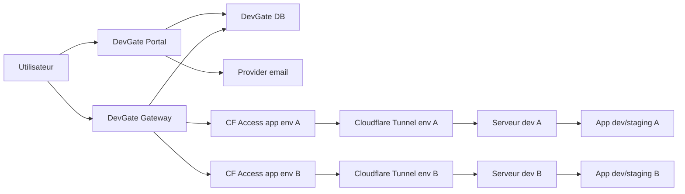
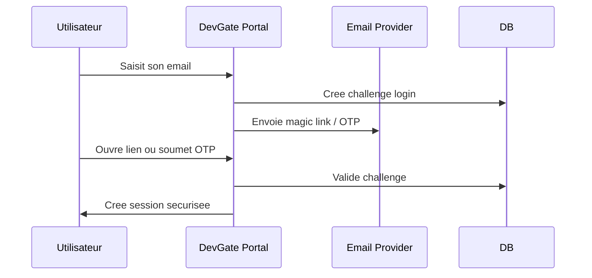
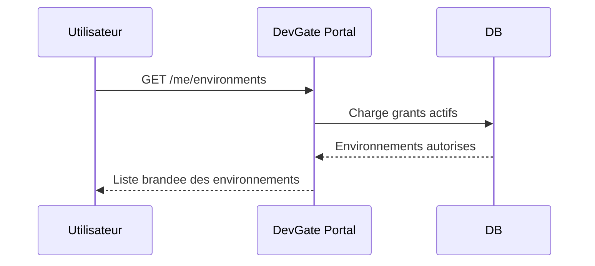
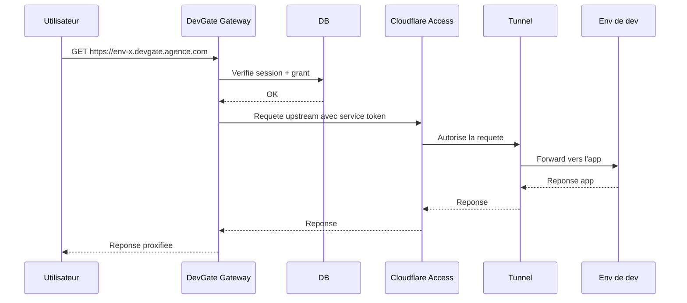
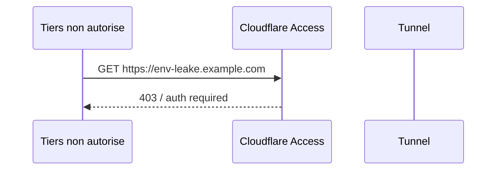

# Architecture cible - DevGate

## Statut

Draft v1

## Objet

Ce document decrit la cible technique de DevGate a partir du besoin clarifie :

- les **serveurs de dev** ne doivent pas etre exposes directement sur Internet ;
- le **portail d'acces** peut etre public ;
- la gestion des **utilisateurs finaux** doit etre portee par DevGate ;
- la page de login et le portail doivent etre **brandes agence** ;
- la liste des environnements accessibles est un besoin central ;
- `Cloudflare Tunnel` est accepte comme brique de transport gratuite ;
- le reste peut etre **OSS**, **build custom**, ou un **mix**.

L'objectif est de definir une architecture cible **sobre, maintenable et productisable** sans partir dans une sur-conception.

---

## 1. Resume executif

### Decision d'architecture

La cible recommandee est une architecture **hybride** :

- `Cloudflare Tunnel` pour **cacher l'origine** des environnements ;
- `Cloudflare Access` en **service-to-service auth** entre DevGate et les environnements ;
- `DevGate` comme **couche produit centrale** pour :
  - login utilisateur,
  - branding,
  - liste des environnements,
  - autorisations,
  - back-office agence ;
- un **gateway reverse proxy** porte par DevGate pour router le trafic utilisateur vers les environnements autorises.

### Idee cle

On ne donne **jamais** au navigateur du client le hostname tunnel Cloudflare comme URL finale.

Le navigateur parle a **DevGate**.  
DevGate parle a l'environnement via **Cloudflare Tunnel + Access service token**.

Donc :

- les serveurs de dev ne sont pas exposes directement ;
- le hostname tunnel peut fuiter sans devenir exploitable s'il est protege par Access service token ;
- l'experience utilisateur reste entierement brandee et controlee par l'agence.

---

## 2. Contraintes confirmees

### Fonctionnelles

- login simple : OTP email, magic link, passkey ensuite si utile ;
- navigation principale **par client** avec liste des ressources accessibles ;
- administration centralisee par client / projet / environnement / acces ;
- possibilite d'avoir des environnements avec leur **propre auth applicative**.

### Non fonctionnelles

- pas de VPN ;
- pas d'installation cote client ;
- pas de mot de passe partage ;
- reduction forte de l'exposition reseau des serveurs de dev ;
- UX propre et brandee agence ;
- maintenance raisonnable ;
- cout de la couche externe de transport / protection a garder maitrise.

### Hypotheses d'echelle

- `50 a 75` utilisateurs a court / moyen terme ;
- `20 a 25` environnements a court / moyen terme ;
- faible a moyenne concurrence ;
- trafic majoritairement HTTP / HTTPS ;
- websockets possibles sur certains environnements.

---

## 3. Choix d'architecture

### 3.1 Ce qui est confirme

- `Cloudflare Tunnel` sert a **rendre l'origine non accessible directement**.
- `DevGate` gere les **utilisateurs finaux**.
- `DevGate` gere les **droits d'acces**.
- le modele d'acces v1 est **par client** : un utilisateur rattache a un client accede aux ressources de ce client.
- `DevGate` gere le **branding** de la login page et du portail.
- le branding v1 est **agence uniquement**.
- Les utilisateurs finaux ne doivent pas dependre de la login page Cloudflare.

### 3.2 Ce qui est suppose

- `Cloudflare Access` peut etre utilise en mode **service token** entre DevGate et chaque application publiee derriere tunnel.
- L'usage service token ne doit pas etre transforme en experience utilisateur Cloudflare.
- Les environnements restent atteignables uniquement par un appel porte par DevGate.

### 3.3 Ce qui reste ouvert

- impact exact de cette variante sur la facturation Access ;
- niveau d'automatisation v1 du provisioning Tunnel / DNS / Access App ;
- besoin exact en audit long terme.

### 3.4 Stack retenue

- frontend web : `Next.js`
- backend : `FastAPI`
- stockage : `PostgreSQL`

---

## 4. Vue d'ensemble



### Lecture du schema

- L'utilisateur ne parle qu'a `DevGate`.
- `DevGate Gateway` reverse-proxy ensuite vers les environnements.
- Chaque environnement publie un endpoint via `Cloudflare Tunnel`.
- `Cloudflare Access` bloque toute requete vers cet endpoint si elle ne porte pas le **service token** attendu.

---

## 5. Composants

## 5.1 DevGate Portal

Responsabilites :

- page de login agence ;
- envoi OTP / magic link ;
- creation et renouvellement de session ;
- page "mes environnements" ;
- page client listant les ressources accessibles ;
- back-office agence ;
- ecrans projet / environnement / acces / audit.

Stack retenue :

- `Next.js`
- `React`
- `TypeScript`

Ne fait pas :

- pas de tunneling ;
- pas d'auth Cloudflare pour les users finaux ;
- pas de provisioning infra complet en v1 sauf si explicitement ajoute.

## 5.2 DevGate Gateway

Responsabilites :

- verifier la session utilisateur ;
- resoudre l'environnement cible ;
- verifier que l'utilisateur a le droit d'y acceder ;
- ouvrir une requete upstream vers l'application cible ;
- injecter les credentials `Cloudflare Access service token` ;
- proxy HTTP, headers, cookies, websockets.

Ce composant est le coeur technique de la v1.

Il peut etre :

- integre a l'app DevGate ;
- ou separe dans un service dedie.

### Recommandation v1

Commencer par un produit DevGate a deux apps :

- `Next.js` pour le web
- `FastAPI` pour l'API, l'auth et le gateway

Le gateway vit dans `FastAPI`.

## 5.3 Cloudflare Tunnel

Responsabilites :

- relier chaque environnement de dev a Cloudflare en sortie ;
- eviter l'ouverture de ports entrants sur les serveurs de dev ;
- fournir un hostname stable de transit.

Important :

- le tunnel **ne fait pas** l'autorisation user finale ;
- il ne doit pas etre utilise comme URL directement communiquee au client.

## 5.4 Cloudflare Access

Dans cette cible, Access est utilise en **service auth**, pas comme login utilisateur principal.

Responsabilites :

- exiger un `service token` sur les requetes HTTP qui arrivent au hostname tunnel protege ;
- bloquer a l'edge les requetes non autorisees ;
- rendre non exploitable un hostname tunnel fuite, tant qu'il est protege par Access.

DevGate Gateway stocke pour chaque environnement :

- soit un `client_id + client_secret`,
- soit une abstraction vers un secret store qui les fournit.

## 5.5 Serveur de dev

Chaque serveur de dev embarque :

- `cloudflared`
- l'application de dev / staging
- eventuellement un reverse proxy local deja existant (`nginx`, `caddy`, `traefik`)

Dans cette variante cible, **pas besoin d'un guard local obligatoire** si Access est bien impose au hostname tunnel.

Un guard local reste possible en defense supplementaire, mais n'est plus structurant pour la v1.

---

## 6. Flux principaux

## 6.1 Login utilisateur



## 6.2 Consultation du portail



## 6.3 Acces a un environnement



## 6.4 Si le hostname tunnel fuite



Point important :

- le visiteur n'a pas besoin du `tunnel token` ;
- mais il doit passer le controle `Access` ;
- si `Access` exige un `service token`, une requete navigateur brute est bloquee.

---

## 7. Cas des environnements qui ont deja leur propre auth

Cette architecture supporte tres bien le cas deja accepte :

- **couche 1** : DevGate controle l'acces a l'environnement ;
- **couche 2** : l'application controle son auth metier interne.

Exemple :

- l'utilisateur se logge dans DevGate ;
- accede a `staging-client-x.devgate.agence.com` ;
- puis voit la page de login WordPress / Laravel / app interne.

### Effet

- DevGate ne remplace pas l'auth de l'application ;
- DevGate ajoute une **porte d'entree commune** ;
- l'app reste libre d'avoir sa propre auth.

### Consequence produit

Chaque environnement doit porter un mode :

- `preview_only` : pas d'auth app attendue ;
- `app_auth_required` : auth DevGate + auth app ;
- `internal_only` : acces limite equipe agence.

---

## 8. Routage et URL

## 8.1 URL publiques recommandees

Utiliser des **sous-domaines** par environnement :

- `client-x-staging.devgate.agence.com`
- `client-y-preview-42.devgate.agence.com`

Pourquoi :

- plus propre pour les applications web modernes ;
- evite beaucoup de problemes de paths absolus ;
- simplifie cookies, CSP, websockets, assets.

## 8.2 Upstreams internes

Chaque environnement a :

- une URL publique DevGate ;
- un upstream Cloudflare protege ;
- un mapping stable en base.

Exemple :

- public : `https://client-x-staging.devgate.agence.com`
- upstream : `https://cf-env-x-abc.example.net`

Le navigateur ne doit jamais recevoir l'upstream Cloudflare comme lien d'entree principal.

---

## 9. Donnees et stockage

## 9.1 Choix de base

### POC

- `SQLite` acceptable

### Production initiale

- `PostgreSQL` recommande

Raison :

- moins de friction si le produit devient vite critique ;
- meilleure evolutivite pour audit, concurrence admin, backup, migration.

## 9.2 Secrets

Les secrets ne doivent pas etre stockes en clair dans la base applicative.

Typologie de secrets :

- tokens email provider
- service tokens Cloudflare Access
- tokens API Cloudflare
- eventuels secrets de provisioning

### Recommendation v1

- DB pour les references ;
- secret store simple au choix :
  - variables d'environnement en POC ;
  - `1Password`, `Vault`, `Doppler`, ou equivalent en prod.

---

## 10. Data model

## 10.1 Entites coeur

### User

- `id`
- `email`
- `display_name`
- `kind` (`client`, `agency`)
- `status`
- `last_login_at`
- `created_at`

### Organization

- `id`
- `name`
- `slug`
- `branding_name`
- `logo_url`
- `primary_color`
- `support_email`

### Project

- `id`
- `organization_id`
- `name`
- `slug`
- `status`
- `description`

### Environment

- `id`
- `project_id`
- `name`
- `slug`
- `kind` (`dev`, `staging`, `preview`, `internal`)
- `public_hostname`
- `upstream_hostname`
- `cloudflare_tunnel_id`
- `cloudflare_access_app_id`
- `service_token_ref`
- `requires_app_auth`
- `status`
- `created_at`

### AccessGrant

- `id`
- `user_id`
- `organization_id`
- `role` (`client_member`, `reviewer`, `agency_admin`)
- `created_at`
- `revoked_at`

### Session

- `id`
- `user_id`
- `expires_at`
- `created_at`
- `last_seen_at`
- `ip`
- `user_agent`

### LoginChallenge

- `id`
- `user_id`
- `type` (`magic_link`, `otp`)
- `hashed_token`
- `expires_at`
- `used_at`
- `attempt_count`

### AuditEvent

- `id`
- `actor_user_id`
- `event_type`
- `target_type`
- `target_id`
- `metadata_json`
- `created_at`

### TunnelHealthSnapshot

- `id`
- `environment_id`
- `status`
- `replica_count`
- `observed_at`
- `metadata_json`

## 10.2 Relations

- une `Organization` a plusieurs `Projects`
- un `Project` a plusieurs `Environments`
- un `User` a plusieurs `AccessGrants`
- une `Organization` a plusieurs `AccessGrants`
- un `Environment` reference un couple :
  - `Tunnel`
  - `Access app`
  - `service token`

---

## 11. API contracts

## 11.1 Auth publique

### `POST /auth/start`

Input :

```json
{
  "email": "client@example.com"
}
```

Output :

```json
{
  "ok": true,
  "method": "magic_link"
}
```

### `POST /auth/verify`

Input :

```json
{
  "token": "opaque-token"
}
```

Output :

```json
{
  "ok": true,
  "session_created": true,
  "redirect_to": "/app"
}
```

## 11.2 Portal

### `GET /me`

Output :

```json
{
  "id": "usr_123",
  "email": "client@example.com",
  "display_name": "Client X"
}
```

### `GET /me/environments`

Output :

```json
[
  {
    "id": "env_123",
    "organization_name": "Client X",
    "project_name": "Refonte site",
    "environment_name": "Staging",
    "kind": "staging",
    "url": "https://client-x-staging.devgate.agence.com",
    "requires_app_auth": true
  }
]
```

## 11.3 Back-office agence

### `POST /admin/organizations`
### `POST /admin/projects`
### `POST /admin/environments`
### `POST /admin/access-grants`
### `DELETE /admin/access-grants/{id}`
### `GET /admin/environments`
### `GET /admin/audit-events`

## 11.4 Gateway

Le gateway n'a pas besoin d'etre expose comme API publique riche.  
Il agit surtout comme reverse proxy applicatif.

Il a toutefois une logique interne equivalente a :

### `GET /_gateway/resolve`

Input logique :

- hostname demande
- session user

Output logique :

```json
{
  "environment_id": "env_123",
  "upstream_hostname": "https://cf-env-x-abc.example.net",
  "service_token_ref": "svc_tok_env_123"
}
```

---

## 12. Sessions, auth et securite

## 12.1 Auth utilisateur

### v1 recommandee

- magic link email
- OTP email en fallback possible

### v1.5 possible

- passkeys pour users recurrent agence

### A ne pas faire en v1

- SSO corporate client
- federation complexe multi-IdP

## 12.2 Sessions

- cookie `HttpOnly`
- `Secure`
- `SameSite=Lax`
- rotation de session apres login
- TTL configurable (`7 jours` est acceptable)

## 12.3 Service-to-service auth

Pour chaque environnement :

- une app `Cloudflare Access`
- un `service token`
- le Gateway envoie ce token a chaque requete upstream

Remarque :

- si une app Access est configuree uniquement avec `Service Auth`, le token doit etre presente sur les requetes subsequentes ;
- si des policies `Allow` coexistent, un JWT Access peut etre reutilise ensuite.

Pour la cible DevGate, la variante la plus lisible est :

- **requete upstream toujours signee par le Gateway** ;
- pas de dependance a un cookie navigateur Cloudflare.

## 12.4 Defense supplementaire optionnelle

Si besoin defense-in-depth :

- validation de l'identite Access a l'origine ;
- allowlist d'IPs / restrictions local proxy ;
- logs de correlation `request_id`.

Ce n'est pas obligatoire pour un POC si le tunnel est bien protege par Access service token.

---

## 13. Observabilite et exploitation

## 13.1 Metriques minimales

- nombre de logins reussis / refuses
- taux d'erreur gateway
- latence moyenne vers upstreams
- disponibilite du portail
- statut des tunnels
- taux de 403 Access sur upstreams

## 13.2 Logs utiles

- event logs DevGate :
  - login start
  - login success
  - login failure
  - access granted
  - access denied
  - grant created / revoked
- logs gateway :
  - upstream target
  - status code
  - latency
  - websocket upgrades

## 13.3 Alertes

- tunnel down
- erreur auth email provider
- hausse brutale de 403 ou 5xx
- expiration proche de service token

---

## 14. Fiabilite et evolution

## 14.1 Ce qui suffit en v1

- monolithe unique ;
- une DB ;
- un seul gateway logique ;
- deploiement simple ;
- backup quotidien ;
- monitoring basique.

## 14.2 Ce qui devra etre revisite si le systeme grossit

- split Portal / Gateway si le trafic HTTP devient important ;
- mise en cache des grants ;
- HA de la DB ;
- provisionnement automatise complet des tunnels ;
- rotations automatisees des service tokens ;
- multi-agence / multi-tenant plus strict ;
- modele de secrets plus robuste.

---

## 15. Trade-offs

## 15.1 Pourquoi cette cible est bonne

- elle garde `Cloudflare Tunnel` comme brique de transport simple ;
- elle evite de deleguer l'experience login utilisateur a Cloudflare ;
- elle rend le **branding** maitrise ;
- elle protege les environnements meme si le hostname de tunnel fuite ;
- elle permet de garder un **mode double auth** avec l'application quand c'est necessaire ;
- elle reste compatible avec un futur packaging produit.

## 15.2 Ce qu'elle coute

- il faut construire et maintenir DevGate ;
- il faut gerer les sessions, les grants, l'audit et le proxy ;
- l'usage exact de `Cloudflare Access` en service auth doit etre confirme contractuellement / tarifairement ;
- le gateway reverse proxy devient un composant critique ;
- certaines apps peuvent demander du travail de compatibilite (websockets, cookies, redirects, CSP).

## 15.3 Pourquoi ne pas faire plus simple

### `Tunnel seul`

Insuffisant :

- un hostname fuite reste tentable publiquement ;
- pas de controle d'acces a l'edge ;
- besoin d'un guard local ou d'un contournement equivalent.

### `Cloudflare Access comme login utilisateur principal`

Possible, mais moins bon pour le besoin actuel :

- branding et UX moins maitrises ;
- plus grande dependance produit a Cloudflare ;
- moins de coherence avec un portail agence.

### `Tout construire sans Access`

Possible, mais moins propre :

- il faut reintroduire un guard local ;
- la securite d'acces edge devient plus artisanale ;
- plus de code a maintenir.

---

## 16. Plan de mise en oeuvre conseille

## Phase 1 - POC technique

- 1 portail DevGate simple
- 1 login magic link
- 1 environnement tunnel
- 1 app Access protegee par service token
- 1 reverse proxy gateway
- 1 utilisateur test

Critere de validation :

- un utilisateur connecte peut acceder a l'environnement via DevGate ;
- le hostname tunnel direct sans service token est bloque ;
- si l'app a sa propre auth, elle apparait apres le passage DevGate.

## Phase 2 - MVP agence

- back-office minimal
- grants par environnement
- liste des environnements
- audit minimal
- health/status tunnel
- branding agence

## Phase 3 - Industrialisation

- provisioning automatise
- rotation de secrets
- supervision plus riche
- deploiement plus robuste

---

## 17. Questions ouvertes

- Le cout de `Cloudflare Access` en usage service token only est-il compatible avec la cible economique ?
- Faut-il du branding :
  - global agence,
  - ou differencie par client ?
- Le MVP doit-il gerer :
  - seulement les acces individuels,
  - ou aussi groupes et domaines email ?
- Faut-il exposer dans le portail :
  - seulement la liste des environnements,
  - ou aussi leur statut en temps reel ?

---

## 18. Conclusion

La cible DevGate la plus coherente aujourd'hui est :

- **DevGate comme produit d'acces**
- **Cloudflare Tunnel comme transport**
- **Cloudflare Access service tokens comme garde edge**
- **les applications de dev libres de garder leur propre auth interne**

Cette architecture tient le besoin reel :

- serveur de dev non expose directement ;
- portail public et brandable ;
- auth utilisateur simple ;
- liste des environnements ;
- bypass par hostname fuite bloque a l'edge ;
- possibilite de garder la double auth avec l'application.

Elle est plus solide qu'un `Tunnel seul`, et plus maitrisee cote UX qu'un `Cloudflare Access` utilise comme login principal.
